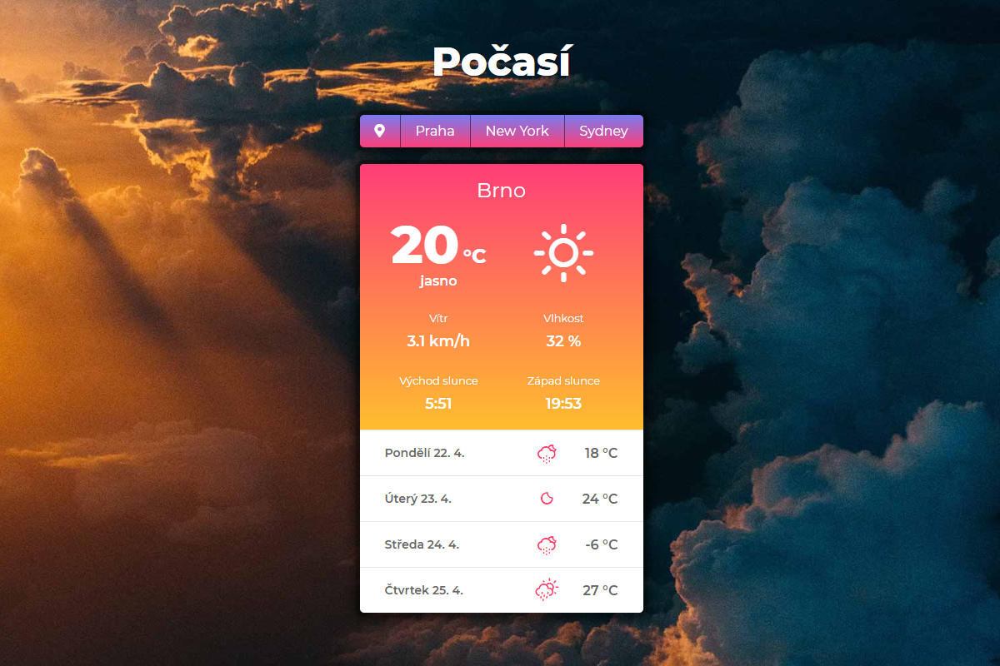
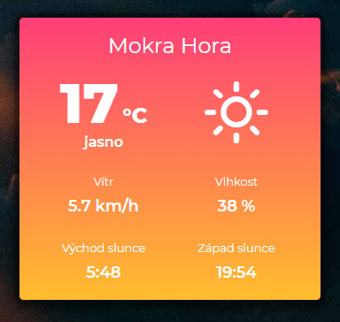
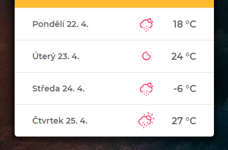
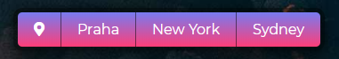

# Úkol - Počasí

Vytvoř aplikaci, která bude ukazovat aktuální počasí ve vybraném místě a předpověď na další dny.

Tento úkol je povinný, ale má spoustu volitelných částí pro ty, kteří základy v pohodě ovládají a chybí jim v akademii nějaká pořádná výzva. Nelekej se dlouhého zadání - popisuji ti podrobně krok za krokem, co máš dělat, a velkou část tvoří právě ty volitelné úkoly pro šprtky.

**Doporučuji, aby sis nejprve přečetla celý tento text, než začneš programovat.** Během zadání je několik míst, kde se můžeš rozhodnout, jak budeš dál postupovat, a je lepší o nich vědět dopředu, abys třeba některé věci nedělala zbytečně (týká se hlavně předpovědi počasí na následující dny).


**Obsah:**
- [HTML a CSS](#HTML-a-CSS)
- [JavaScript nebo Vue.js](#JavaScript-nebo-Vue.js)
- [Co budeš potřebovat](#Co-budeš-potřebovat)
- [Povinná část úkolu](#Povinná-část-úkolu)
- [Bonusové úkoly](#Bonusové-úkoly)





## HTML a CSS

Protože tento úkol je hlavně na procvičení JavaScriptu a komunikace se serverovým API, není jeho primárním účelem trénovat psaní HTML a CSS. Ale samozřejmě pochvalně kývu hlavou, chceš-li si oboje také procvičit.

Výchozí verze souborů `index.html` a `style.css` obsahují hotový HTML a CSS kód. Kompletně nastylovanou celou aplikaci.

Ve složce ale máš připravené i soubory `index-level2-tezsi.html` a `style-level2-tezsi.css`, které obsahují jen ty úplně nezbytné kousky kódu a jinak nic. Do nich si můžeš celou aplikaci vytvořit sama, bez mojí pomoci. Nebo můžeš úroveň složitosti nakombinovat a použít moje hotové HTML a jen k němu dopsat svůj CSS styl.

Rozhodneš-li se pro těžší level, doporučuji soubory přejmenovat na standardní `index.html` a `style.css`, než s nimi začneš pracovat.


## JavaScript nebo Vue.js

Úkol byl původně myšlen tak, že ho vypracujete v čistém JavaScriptu, ale protože už začínáme s Vue.js, klidně **můžeš (ale nemusíš) tento úkol vypracovat pomocí Vue.js**, pokud si na to troufáš.

I ta základní znalost Vue.js, kterou teď máš, by ti na aplikaci Počasí mohla stačit a spoustu věcí ti naopak Vue.js výrazně ulehčí.

Rozhodneš-li se jít cestou Vue.js, musíš si do HTML stránky nalinkovat javascriptový soubor vue.js (ať už lokálně nebo z internetu) a upravit si HTML stránku a udělat z ní Vue šablonu. Stačí se podívat na příklady, které jsme dělali na první lekci Vue.js.

Znovu opakuji, že je zcela na tobě, zda úkol vypracuješ jen v čistém JavaScriptu, nebo zda použiješ Vue.


## Co budeš potřebovat

Tento úkol používá API serveru [OpenWeatherMap](https://openweathermap.org). Pro používání API se musíš zaregistrovat a získat svůj osobní **API klíč**, který je potřeba přikládat jako autentifikaci ke každému dotazu do API.

Registraci a klíč už bys měla mít z dřívějška, když jsme s počasím pracovali v předchozích lekcích. Klíč máš buď v emailu, který ti přišel po registraci, nebo ho najdeš po přihlášení i ve svém profilu na OpenWeatherMap.

Verze API, která je zdarma, má **limit 60 dotazů za minutu**. Předpokládám, že nebudeš stránku obnovovat každou vteřinu, takže by tě tento limit neměl nijak limitovat, ale je dobré o něm vědět.


## Povinná část úkolu

Opravdu povinné jsou první dva body v seznamu. Třetí je zahrnut v povinné části a chtěl bych, abys ho opravdu zkusila, ale prominu ti, pokud na to nebudeš mít čas. Ale zkus to prosím.

První bod bys měla zvládnout úplně v pohodě, druhý bude možná trochu těžší, ale i ten bys měla s trochou přemýšlení bez problémů dokončit. Každopádně, **ptej se na cokoliv** - na Slacku, na lekcích nebo v pracovních skupinkách. Odpovíme na jakýkoliv dotaz. Úkol není test, zda už všechno umíš, ale naopak způsob, jak se všechno naučit a zkusit si to. Takže ještě jednou, prosím, **ptej se**.

Takže úkoly:

### **1. Zjisti aktuální počasí ve vybraném městě**

Vyber si nějaké město (např. Brno) a polož dotaz do API na adresu:

`https://api.openweathermap.org/data/2.5/weather?q=Brno,cz`

Nezapomeň, že do adresy musíš přidat i svůj API klíč do parametru *appid* a pokud chceš data ve stupních celsia a v čestině, musíš přidat parametry i pro to. Parametry se od sebe oddělují znakem `&`. Na pořadí parametrů nezáleží.

Celá adresa pro zjištění aktuálního počasí v daném městě pak může vypadat například takto (kde *XXXXX* nahradíš svým skutečným API klíčem):

`https://api.openweathermap.org/data/2.5/weather?q=Brno,cz&units=metric&lang=cz&appid=XXXXX`

Podrobnosti o případných dalších parametrech a o tom, jaká data API vrací zpátky, si můžeš zjistit v [dokumentaci pro API aktuálního počasí](https://openweathermap.org/current).

Z dat, která ti API vrátí budeš potřebovat následující údaje (za dvojtečkou je vždy uvedena vlastnost, ve které se údaj nachází v JSON objektu vráceném ze serveru):
- název místa: `name`
- aktuální teplota: `main.temp`
- slovní popis počasí (např. polojasno): `weather[0].description`
- ID počasí: `weather[0].id`
- ikona počasí: `weather[0].icon`
- vlhkost vzduchu: `main.humidity`
- rychlost větru: `wind.speed`
- čas východu slunce: `sys.sunrise`
- čas západu slunce: `sys.sunrise`


### **2. Zobraz data na stránce**

V HTML a CSS je připravená šablona celé aplikace. Data získaná z API stačí vzít a doplnit je do vybraných prvků na stránce.

HTML prvky na stránce mají vždy přidělené id: `mesto`, `teplota`, `popis`, `ikona`, `vitr`, `vlhkost`, `vychod`, `zapad`. Až na výjimky stačí měnit jejich textový obsah, takže pro zápis do jednotlivých elementů používej jejich vlastnost `textContent` (v případě, že se rozhodneš použí Vue.js, tak samozřejmě jinak).

Ale pozor... (snad sis nemyslela, že to bude jen tak :))

- Aktuální teplota někdy přijde z API jako desetinné číslo, což se nám nelíbí. Nikoho nezajímá, že teplota je 17.37 stupně. Teplotu zaokrouhli na celé číslo.
- Rychlost větru bývá někdy uvedena na více desetinných míst, my chceme zobrazovat pouze jedno desetinné místo. Použij třeba metodu `toFixed()` - [dokumentace](https://developer.mozilla.org/en-US/docs/Web/JavaScript/Reference/Global_Objects/Number/toFixed).
- Časy východu a západu slunce přijdou z API ve formátu, kterému se říká **UNIX timestamp**. Když si vypíšeš data ze serveru do konzole, uvidíš, že východ slunce je tam uveden třeba jako číslo *1555818654*.

  Formát UNIX timestamp udává čas jako celkový počet vteřin, který uběhl od 1.1.1970 00:00:00. Asi chápeš, že tohle uživateli opravdu zobrazovat nechceme :) JavaScript má vestavěný datový typ datum/čas a ty můžeš použít následující kód pro převod čísla z UNIX timestamp na javascriptové datum (dokumentace pro [Date](https://developer.mozilla.org/en-US/docs/Web/JavaScript/Reference/Global_Objects/Date), [getHours](https://developer.mozilla.org/en-US/docs/Web/JavaScript/Reference/Global_Objects/Date/getHours), [getMinutes](https://developer.mozilla.org/en-US/docs/Web/JavaScript/Reference/Global_Objects/Date/getMinutes)):

  ```javascript
  // převede UNIX timestamp na javascriptový objekt datum/čas
  let datum = new Date(hotnotaUnixTimestamp * 1000);

  // z tohoto objektu pak můžeme získat hodiny, minuty (a další) pomocí vestavěných metod
  let hodiny = datum.getHours();
  let minuty = datum.getMinutes();
  ```

  Když už máš hodiny a minuty, tak přidat mezi ně dvojtečku a výsledek vypsat do stránky už by snad neměl být problém.

- Největší oříšek je asi ikona počasí. V datech z API je název obrázku ikony (např. `01d`), který pak můžeš do stránky nalinkovat přímo z OpenWeatherMap.

  Ikony jsou uloženy na serveru OpenWeatherMap na adrese `https://openweathermap.org/img/wn/01d@2x.png`, kde `01d` nahradíš vždy správným názvem ikony, který sis přečetla v datech. Server ti vrátí obrázek o velikosti 100x100 px. Kdybys chtěla menší obrázek (50x50 px), odstraň z adresy `@2x` ppřed příponou `.png` na konci.

  Podrobnosti o ikonách najdeš v [dokumentaci API](https://openweathermap.org/weather-conditions).

  Teoreticky tedy stačí dovnitř HTML prvku na stránce, který má `id="ikona"`, vložit obrázek s příslušnou adresou. Toto je jedna z těch výjimek, kde musíš použít `innerHTML`, protože budeš do prvku vkládat HTML obsah (značku obrázku). Nebo můžeš použít `document.createElement` a `rodič.appendChild` (viz lekce o vytváření elementů).

  Pokud to uděláš takhle, nebudu se zlobit, ale... :) Já mám s ikonami z OpenWeatherMap drobn7 problém. Dřív byly vyloženě ošklivé. OpenWeatherMap má teď ikony nové, které jsou siceOK, ale moc se nehodí do designu naší aplikace.

  Chceš-li mírnou challenge a hezčí ikony, můžeš udělat následující:

  Do startovního kódu jsem připojit speciální font a CSS styl, s jejichž pomocí jdou vkládat krásné minimalistické jednobarevné ikony počasí. Problém je, že je potřeba převést kód ikony a stavu počasí získaný z OpenWeatherMap na jiný kód, který vykreslí hezkou ikonu z připojeného fontu.

  Abys toto nemusela dělat (je to trochu kompikovanější), máš ve startovním balíčku už hotovou funkci uloženou v samostatném **.js** souboru, která to udělá za tebe. Skript `weather-icons.js` je na konci HTML zakomentovaný. Chceš-li ho použít, **musíš si ho v HTML odkomentovat**.

  Do funkce je potřeba předat dva parametry: id počasí a kód ikony z API OpenWeatherMap. Funkci pak můžeš použít následujícím způsobem:

  ```javascript
  // předpokládám, že data získaná z API jsou v proměnné data
  // máš-li proměnnou pojmenovanou jinak, tak kód náležitě uprav
  let novaIkona = getWeatherIcon(data.weather[0].id, data.weather[0].icon);

  // proměnná novaIkona nyní obsahuje HTML ve tvaru:
  // <i class="wi wi-day-sunny"></i>
  // toto HTML je potřeba vložit do prvku s id="ikona"

  // nalezení cílového elementu pomocí querySelector nebudeš dělat
  // pokaždé, ale pravděpodobně pouze jednou někde na začátku aplikace
  let ikonaElement = document.querySelector('#ikona');

  // nahradíme HTML obsah cílového prvku naší ikonou
  ikonaElement.innerHTML = novaIkona;
  ```

  Máš-li vše správně, měla bys na stránce vidět něco takového:

  


 Skončíš-li s povinnou částí úkolu tady, je to v pořádku. Beru to tak, že možná nemáš tolik času na poslední 3 krok. Pokud ale čas máš, zkus prosím ještě i následující část úkolu.


### **3. Přidej předpověď počasí na následující 4 dny**

*Poznámka: Tato část úkolu jde vyřešit dvěma způsoby. Zde podrobně popisuji jeden, ale od doby, kdy jsme tento úkol původně vytvořil, tak do OpenWeatherMap přibyla nová funkce, která umožňuje získat předpověd počasí o trochu jednodušším způsobem. Můžeš se sama rozhodnout, jaký způsob použiješ. Druhý způsob je zběžně popsán v [další sekci](#Způsob-2).*


#### **Způsob 1**

Data pro předpověď počasí získáš pomocí dalšího dotazu na server. Adresa API předpovědi je následující:

`https://api.openweathermap.org/data/2.5/forecast?q=Brno,cz`

**Nezapomeň opět připojit i parametry pro metrický systém, češtinu a svůj API klíč, jako v případě prvního dotazu.**

Podrobnosti o možných parametrech a vrácených datech najdeš v [dokumentaci k API pro 5 denní předpověď](https://openweathermap.org/forecast5).

V rámci používání OpenWeatherMap API zdarma je k dispozici předpověď pro následujících 5 dní, v intervalech po 3 hodinách.

Z API dostaneš data, ve kterých je vlastnost `list`, která obsahuje pole 40 položek - 40 předpovědí vždy po 3 hodinách, počínaje nejbližší celou tříhodinovkou (podle toho, kolik je momentálně hodin). Předpovědi jsou v časových intervalech 0:00 hodin (půlnoc), 3:00, 6:00, 9:00, 12:00, 15:00, 18:00 a 21:00. Tj. 8 předpovědí na den.

Je-li ve chvíli, kdy se serveru ptáme na předpověd, třeba 17:15, budou data začínat předpovědí od 18:00. Je-li v čase dotazu na server třeba 15:40, budou data začínat v 15:00 - kousek do minulosti, protože je to nejbližší tříhodinovka.

V rámci tohoto úkolu si nebudeme komplikovat věci tím, že bychom zjišťovali, kde přesně v datech začíná následující den, ale budeme to brát tak, že jako předpověď počasí v naší aplikaci zobrazíme vždy 4 údaje, počínaje osmým v pořadí (tj. "zítra" počítáno od prvního údaje v poli - 8x3 hodin = za 24 hodin). Zajímat nás tedy budou prvky pole předpovědí `list[8]`, `list[16]`, `list[24]` a `list[32]`. Tyto záznamy chceme v naší aplikaci zobrazit jako předpověď na následující 4 dny, i když to bude často hodně nepřesné.

V datech pro konkrétní předpověď je vždy vlastnost `dt`, která obsahuje UNIX timestamp pro datum/čas dané předpovědi. Tuto hodnotu si převedeš na JavaScriptové datum a z něj pak můžeš získat datum a den v týdnu, který zobrazíš v HTML - viz. dokumentace [getDate](https://developer.mozilla.org/en-US/docs/Web/JavaScript/Reference/Global_Objects/Date/getDate), [getMonth](https://developer.mozilla.org/en-US/docs/Web/JavaScript/Reference/Global_Objects/Date/getMonth), [getDay](https://developer.mozilla.org/en-US/docs/Web/JavaScript/Reference/Global_Objects/Date/getDay).

**Pozor** na to, že číslování měsíců začíná od nuly - tj. leden je 0. Číslování dnů v týdnu také začíná od 0, ale první je neděle (Amerika!), takže pro nás je pondělí správně hodnota 1.

Zbytek dat už má skoro stejný formát, jako data pro aktuální počasí z kroku 1 úkolu. Podívej se do [dokumentace k API](https://openweathermap.org/forecast5), nebo si data ye serveru vypiš do konzole a prohlédni si je.

Pro zobrazení předpovědi počasí nám bude stačit pro každý den znát **datum, teplotu, ikonu počasí a id počasí**. Ikonu a id počasí můžeš převést na "hezkou ikonu" počasí stejným postupem jako v kroku 2 (viz. výše) nebo použiješ obrázek ze serveru OpenWeatherMap.

Pro každý den předpovědi (měla bys mít 4, opět viz. výše) vytvoř z dat HTML podle následující šablony:

```html
<div class="forecast">
  <div class="forecast__day">
    <!-- den v týdnu a datum, např.: Pondělí 22.4. -->
  </div>
  <div class="forecast__icon">
    <!-- HTML pro ikonu počasí, např.: <i class="wi wi-sunny-day"></i> -->
  </div>
  <div class="forecast__temp">
    <!-- teplota, např.: 18 °C -->
  </div>
</div>
```

Výsledné HTML pro všechny 4 dny vlož do divu s `id="predpoved"`. Pokud se vše povedlo, měla bys pod aktuálním počasím mít něco takového:




#### **Způsob 2**

Jak už jsem zmiňoval, server OpenWeatherMap přidal do svého zadarmového plánu novou službu, která umožňuje získat **předpověd počasí na následujících 7 dní** i jinak, podle mě jednodušeji.

Navíc je super, že součástí této předpovědi je i aktuální počasí. Nemusíš tedy na server pokládat dva dotazy - jeden pro aktuální počasí a druhý pro předpověď, ale stačí pouze jeden, ve kterém dostaneš všechno najednou, krásně přehledně.

API má jedinou "nevýhodu" - nemůžeš pokládat dotaz přímo na konkrétní město, ale musíš použít
GPS souřadnice místa.

Souřadnice měst si můžeš jednoduše najít na Googlu nebo na mapách, pro jednoduchost přikládám pro 3 naše města:

- **Brno:** lat: 49.1951, lon: 16.6068
- **Praha:** lat: 50.0755, lon: 14.4378
- **Ostrava:** lat: 49.8209, lon: 18.2625

Dotaz na server má následující podobu:
`https://api.openweathermap.org/data/2.5/onecall?lat=49.1951&lon=16.6068&exclude=minutely,hourly&units=metric&appid=XXXXX`

*XXXXX* na konci opět nahradíš svým APi klíčem, do parametrů *lat* a *lon* dosadíš GPS souřadnice místa/města.

Parametr *exclude=minutely,hourly* nastavuje, že nechceš předpověď po minutách ani hodinách, ale stačí ti pouze informace o aktuálním počasí a pak denní předpověď na následujích 7 dní. Když parametr *exclude* vypustíš, dostaneš opravdu hodně dat se super podrobnou předpovědí na následujících 48 hodin. To je pro tenhle úkol zbvytečné.

Víc ti tady radit nebudu - postup je podobný jako ve způsobu 1, jen můžeš ušetřit jeden dotaz na server a předpověď na následující dny budeš mít lépe přístupnou (nemusíš rozebírat pole se čtyřiceti předpověďmi v intervalu 3 hodin).

Podrobnosti k API najdeš ve [One Call API dokumentaci](https://openweathermap.org/api/one-call-api).


## Bonusové úkoly

Toto jsou bonusové úkoly pro všechny, kdo chtějí výzvu nebo mají opravdu hodně volného času. Je zcela na tobě, jestli se do nich pustíš nebo ne. I u těchto bonusových částí se kdykoliv zeptej na cokoliv, poradíme se vším, nebo alespoň nasměrujeme správným směrem :)

Následující body nejsou seřazeny podle obtížnosti nebo důležitosti, klidně je udělej na přeskáčku nebo si vyber pouze ty, na které si troufneš nebo které se ti nejvíc líbí.


### **4. Vylepši předpověď počasí**

*Tento bonusový úkol má smysl pouze v případě, že sis vybrala 1. způsob získání předpovědi počasi na následující dny. Pokud sis vybrala 2. způsob, jen tento úkol bezpředmětný.*

V bodu 3 jsme do aplikace doplnili předpověď počasí, ale zjednodušili jsme si práci tím, že jsme vzali z pole předpovědí pevně dané body (prvek pole 8, 16, 24 a 32) bez ohledu na to, na který čas ukazují. Klidně jsme tak jako předpověď na celý následující den použili údaj o teplotě např. ve 3:00 ráno. Asi chápeš, že taková předpověď není pro běžné použití úplně směrodatná.

Vylepši předpověď tak, že:
- nebudeš používat pevně dané prvky v poli, ale skutečně zjistíš, kde v poli předpovědí začíná následující den
- ze všech dat pro daný den vybereš záznam s nejvyšší teplotou a tu zobrazíš v předpovědi společně s ikonkou


### **5. Přidej geolokaci**

Doplň do aplikace geolokaci. Aplikace by při startu mohla zjistit tvoji aktuální polohu a zobrazit počasí v daném místě.

Na MDN najdeš [dokumentaci ke geolokaci](https://developer.mozilla.org/en-US/docs/Web/API/Geolocation_API) a jak se používá.

**POZOR:** Při použití Geolocation API tě prohlížeč vyzve, zda chceš stránce dovolit použít polohové údaje. Aby geolokace fungovala, musíš mu to dovolit. Pokud to jednou zakázeš, musíš si to v nastavení prohlížeče znovu povolit. Kdyby ti geolokace nefungovala i nadále, je možné, že máš kompletně zakázané používání polohových údajů v nastavení systému (Windows/Mac).

Endpointy, na které se posílají dotazy na počasí v místě geografických souřadnic, vypadají takto (opět připoj parametry pro metrický systém, češtinu, api klíč):

```
// pro dotaz na aktuální počasí:
https://api.openweathermap.org/data/2.5/weather?lat=35&lon=139

// pro dotaz na pětidenní předpověď:
https://api.openweathermap.org/data/2.5/forecast?lat=35&lon=139
```

Do parametrů `lat` a `lon` doplníš souřadnice získané z geolokace.

Geolokace na zařízeních bez GPS přijímače (tj. většina počítačů) probíhá odhadem podle toho, do jaké sítě nebo k jaké Wi-Fi je počítač připojen. Tento odhad může být někdy víceméně přesný, ale často je spíše velmi orientační. Tak se nelekni, když ti počítač bude tvrdit, že se podle geolokace nacházíš o desítky kilometrů jinde. Např. u mě doma v Brně mi geolokace často tvrdí, že jsem v Ostravě, protože tam má centrálu můj internetový provider.


### **6. Přidej tlačítka pro volbu města**

V HTML je pod hlavním nadpisem zakomentovaný kus kódu pro tlačítka. Můj hotový CSS styl pro tato tlačítka není moc flexibilní, tak měst nepřidávej víc, než kolik se do vymezeného prostoru vejde, jinak to nebude hezké. Města si vyber podle sebe. Rozumný počet je myslím tak 3 nebo 4 maximálně.



Naprogramuj tlačítka tak, aby pomocí nich šlo přepínat mezí počasím pro daná města. Po kliknutí na tlačítko načti ze serveru data pro dané město a zobraz.

Pokud máš v aplikaci geolokaci (viz. bod 5), ať první tlačítko zapíná počasí pro aktuální polohu.

**POZOR:** Při zkoušení tlačítek nezapomeň, že neplacené API má limit 60 dotazů za minutu. Aplikace používá 2 dotazy (aktuální počasí + předpověď) pro každé zobrazení, takže neklikej na tlačítka během minuty jako zběsilá, ať limit nepřekročíš :)


### **7. Obrázky pozadí pro jednotlivá města**

Pro města, mezi kterými jde přepínat (viz. bod 6), si stáhni z internetu obrázky a při výběru města tento obrázek nastav jako pozadí celé stránky.

Mysli na autorská práva a používej fotobanky, kde jsou obrázky legálně zdarma, např. [Unsplash](https://unsplash.com/) nebo [Pexels](https://www.pexels.com/).


### **8. Měň barvy aplikace podle aktuální teploty**

Standardně je aplikace v teplých červeno-žlutých barvách. Přidej do CSS další barevné varianty a přepínej mezi nimi podle aktuální teploty. Pokud bude chladno, může být aplikace modro-zelená, pod bodem mrazu modro-fialovo-bílá, apod.

Vzhledem k momentálnímu počasí budeš muset teplé nebo chladné počasí asi nasimulovat ruční změnou dat, abys vyzkoušela, zda ti to funguje :)


### **9. Zvuky**

Toto už je totální blbost a overkill pro ty, kdo opravdu nemají nic jiného na práci. Sežeň si různé zvuky a podle různých typů počasí ([dokumentace](https://openweathermap.org/weather-conditions)) přehrávej zvuk deště, bouřky, včely bzučící na louce (=sluníčko), apod.

Nezpomeň, že zvuky jsou často otravné a aplikace by měla mít tlačítko, kterým jdou vypnout.


**Myslím, že na jeden domácí úkol už to stačí :)**
